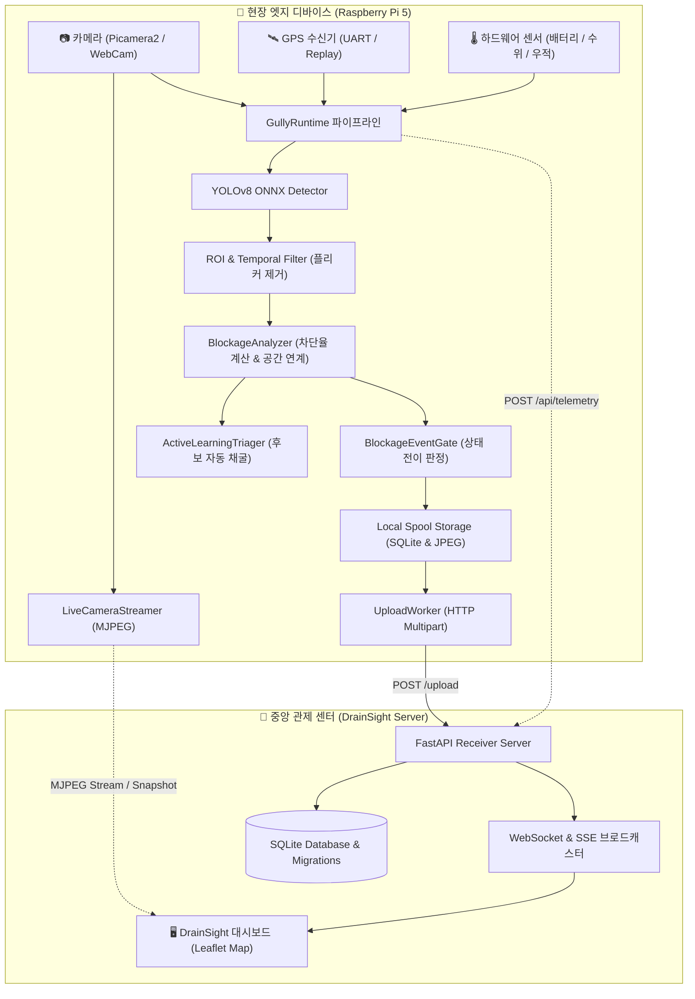
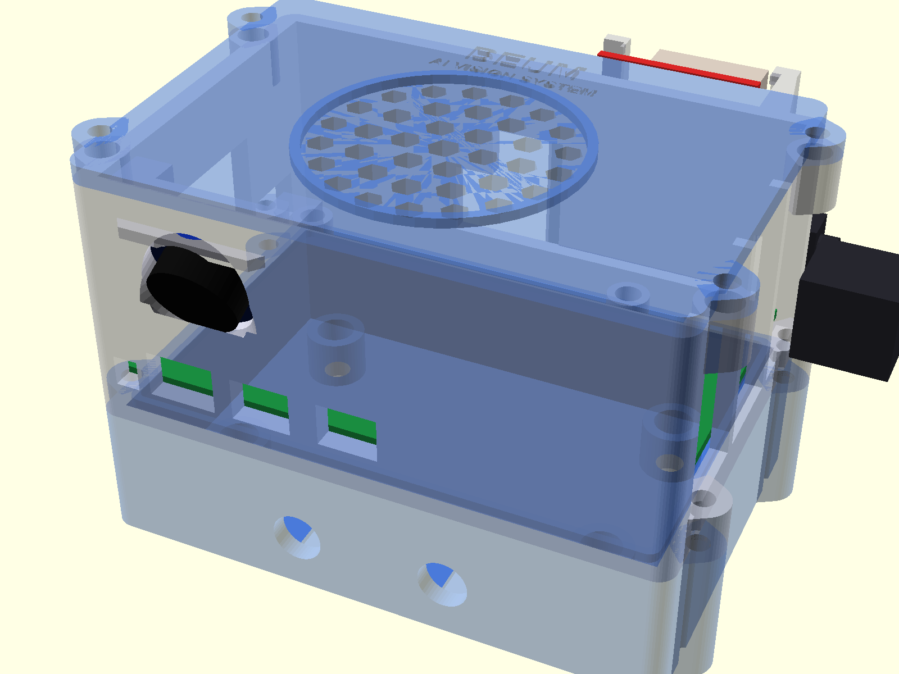
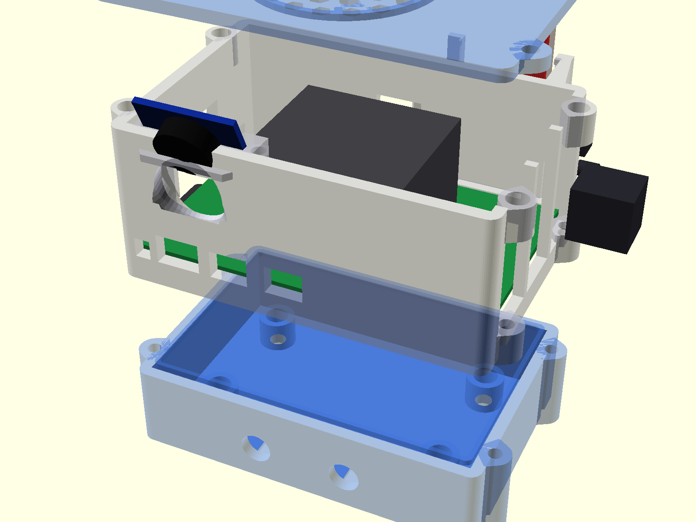

# 🌊 비움 (BEUM)
> **AI 엣지 비전 기반 도로 빗물받이(배수구) 실시간 막힘 탐지 및 스마트 관제 시스템**  
> *Edge-AI Road Gully Drain Blockage Detection & DrainSight Smart Monitoring System*

[](https://www.python.org/)
[](https://fastapi.tiangolo.com/)
[](https://onnxruntime.ai/)
[](https://www.raspberrypi.com/)
[](LICENSE)

---

## 📌 프로젝트 소개 (Overview)

집중호우 시 도로 침수 피해의 주요 원인 중 하나는 낙엽, 쓰레기, 토사 등으로 인한 **도로 빗물받이(배수구)의 막힘**입니다. **비움(BEUM)**은 이동형 수거 차량 또는 순찰 기기에 탑재된 소형 엣지 컴퓨터(Raspberry Pi 5)와 카메라를 이용해, 주행 중 도로변 빗물받이의 위치와 막힘률을 **실시간 AI 비전(YOLOv8 Segmentation)**으로 분석하고 관제 센터로 전송하는 차세대 스마트 시티 수방 관제 솔루션입니다.

### 🎯 핵심 가치
1. **초경량 온디바이스 엣지 추론 (On-Device Edge AI)**: 고가의 GPU 서버 없이도 라즈베리파이 5 CPU 환경에서 320x320 ONNX 인스턴스 세그멘테이션을 실시간 처리.
2. **도심 환경 특화 오탐 방지 알고리즘**: 배수구 그레이팅이 없는 단독 이물질 기각(Spatial Association), 미끄럼 방지 철판 무늬 등에서의 중복 감지 방지.
3. **네트워크 단절 회복력 (Offline Resilience)**: 음영 지역 주행 시 로컬 스풀(Spool)에 이벤트를 안전하게 캐싱하고 통신 복구 시 자동 재전송.
4. **연속 MLOps 능동 학습 (Active Learning)**: 불확실성(Uncertainty)이나 경계 구간의 프레임을 엣지에서 자동 수집(Auto-Triage)하여 모델 지속 고도화.
5. **DrainSight 통합 관제 대시보드**: 실시간 지도 기반 막힘 현황, 차량 실시간 이동 궤적, 현장 AI 비디오 스트리밍 및 오탐 기각(Dismiss) 기능 제공.

---

## 🏗️ 시스템 아키텍처 (System Architecture)



---

## ✨ 주요 기능 (Key Features)

### 1. 지능형 엣지 런타임 (`gully_system`)
- **이중 클래스 인스턴스 세그멘테이션**: `drain_area`(정상 배수구 그레이팅 영역)과 `drain_full`(이물질로 막힌 영역) 픽셀 마스크를 직접 연산하여 정확한 물리적 차단율(`coverage_percent`) 산출.
- **공간 연계 필터 (Spatial Association)**: 배수구가 인식되지 않은 상태에서 단독으로 검출된 낙엽/쓰레기 등은 오탐으로 분류하여 배제.
- **적응형 추론 주기 제어 (Policy System)**: 차량 이동 속도, 배터리 잔량, 강우 센서 수치에 따라 추론 주기(High / Medium / Low) 자동 전환.
- **안정적인 오프라인 큐**: 네트워크가 끊겨도 지정된 용량(기본 2GB) 한도 내에서 증거 사진과 메타데이터를 로컬에 보존.

### 2. MLOps & 하드 네거티브 능동학습 파이프라인 (`tools/`)
- **실시간 트리아지 (Auto-Triage)**: 추론 신뢰도가 애매한 프레임(0.15~0.28), 경계 구간(Warning 20%, Critical 50% 부근)을 엣지에서 자동 감지하여 별도 저장.
- **하드 네거티브 채굴 및 소거(Ablation) 학습**: 실제 도로에서 수집된 오탐 사례를 채굴(`mine_hard_negatives.py`)하고 모델 재학습(`train_hn_ablation.py`) 및 성능 평가(`evaluate_hn_ablation.py`)를 자동화.

### 3. DrainSight 웹 관제 플랫폼 (`receiver_server.py`, `templates/dashboard.html`)
- **실시간 관제 지도**: 수신된 빗물받이 막힘 위험도를 색상별(Normal: 초록, Warning: 주황, Critical: 빨강)로 시각화.
- **실시간 AI 비전 스트리밍**: 현장 카메라의 검출 박스 및 세그멘테이션 마스크 오버레이를 브라우저에서 저지연 MJPEG로 실시간 모니터링.
- **오탐 기각(Dismissal) 및 아카이빙**: 관제자가 대시보드에서 오탐 이벤트를 즉시 기각하면 DB의 `events_false_positive_archive`로 격리되어 통계 및 알림에서 자동 제외.
- **차량 실시간 GPS 텔레메트리**: 순찰 차량의 실시간 위치, 속도, 네트워크 지연 시간 추적.

---

## 🛠️ 하드웨어 구성 및 3D 모델링 (Hardware)

비움은 험로 주행과 야외 진동 환경을 견딜 수 있도록 3D 프린팅 맞춤형 일체형 하우징을 설계 및 검증했습니다.

| 구성 부품 | 사양 / 용도 | 비고 |
| :--- | :--- | :--- |
| **SBC (메인보드)** | Raspberry Pi 5 (8GB / Active Cooler 장착) | 엣지 AI 추론 및 시스템 제어 |
| **카메라 모듈** | Raspberry Pi Camera Module 3 (Wide) / USB WebCam | 도로 노면 광각 캡처 |
| **GPS 모듈** | u-blox NEO-6M / NEO-8M (UART 직렬 연결) | NMEA 센텐스 기반 위치/속도 측정 |
| **보조 센서군** | 아날로그 수위 센서, 우적 감지 센서 | 침수 및 강우 위험 감지 |
| **전원 장치** | 5V 5A 강압 DCDC 컨버터 / UPS 배터리팩 | 차량 시거잭 및 상시 전원 대응 |

<p align="center">
  
  
</p>

> 💡 **하드웨어 양산 로드맵**: 현재 시연용 3D 프린팅 하우징을 기반으로 **[1단계: 센서 융합]** → **[2단계: IP65 방수방진 전용 사출 하우징]** → **[3단계: 공공 수거차량 장기 실증]** 단계로 고도화를 추진하고 있습니다. (`ppt/비움_하드웨어_양산로드맵.pptx` 참조)

---

## 📂 프로젝트 구조 (Directory Structure)

```text
BEUM/
├── gully_system/               # [엣지 코어] 엣지 비전 런타임 및 분석 패키지
│   ├── blockage.py             # 빗물받이 차단율 계산, 공간 연계, 오탐 방지 로직
│   ├── camera.py               # 카메라 캡처 및 프레임 버퍼 관리
│   ├── config.py               # 시스템 환경설정 데이터클래스
│   ├── detector.py             # YOLOv8 ONNX 추론 엔진 (NMS, 마스크 처리)
│   ├── gps.py                  # UART/Replay/UDP GPS 수신 드라이버
│   ├── policy.py               # 센서/배터리 기반 적응형 추론 정책
│   ├── runtime.py              # 엣지 통합 파이프라인 오케스트레이터
│   ├── sensors.py              # 배터리/수위/우적/네트워크 센서 계측
│   └── triage.py               # 능동학습(Active Learning) 트리아지 엔진
│
├── receiver_server.py          # [서버] 중앙 FastAPI 수신 서버 및 이벤트 API
├── drainsight_adapter.py       # [어댑터] GeoJSON, Webhook, SSE 브로드캐스터
├── camera_streamer.py          # [스트리밍] 실시간 MJPEG 비디오 스트리머
├── spool_worker.py             # [네트워크] 오프라인 스풀 복구 및 업로드 워커
│
├── migrations/                 # [DB] SQLite 버전 관리 스키마 및 마이그레이션 러너
│   ├── versions/               # 0001~0005 SQL 마이그레이션 스크립트
│   └── runner.py
│
├── deploy/                     # [배포] 라즈베리파이 현장 배포 파일
│   └── pi/                     # beum-edge.service, setup_pi.sh, requirements-pi.txt
├── scripts/                    # 시스템 설치 및 부트스트랩 스크립트
│
├── templates/                  # [대시보드] DrainSight 웹 관제 프론트엔드 HTML
│   └── dashboard.html
│
├── tools/                      # [도구 및 MLOps] 하드웨어 진단 및 모델 고도화 스크립트
│   ├── hardware_check.py       # 카메라/GPS/센서 종합 진단 CLI & 웹 뷰어
│   ├── mine_hard_negatives.py  # 하드 네거티브 채굴 툴
│   ├── train_hn_ablation.py    # 능동학습 모델 학습 툴
│   └── evaluate_hn_ablation.py # 소거 실험 평가 툴
│
├── models/                     # [모델] 엣지 배포용 경량 ONNX 모델 저장소
├── tests/                      # [테스트] 단위 및 E2E 통합 테스트 스위트 (150+ 테스트)
└── ppt/                        # [발표자료] 3D 모델 렌더링, PPTX 로드맵, 발표 대본
```

---

## 🚀 빠른 시작 (Quick Start)

### 1. 환경 설정 및 의존성 설치

```bash
# 저장소 복제
git clone https://github.com/rkdansdlf/BEUM.git
cd BEUM

# 가상환경 생성 및 활성화
python3 -m venv .venv
source .venv/bin/activate

# 의존성 패키지 설치
pip install -r requirements.txt
```

### 2. 중앙 수신 서버 및 관제 대시보드 실행

```bash
# FastAPI 수신 서버 기동 (기본 포트: 8000)
python receiver_server.py --port 8000 --data-dir received_data

# 또는 Docker Compose로 원클릭 기동
docker compose up -d
```
- 🌐 **DrainSight 대시보드 접속**: 브라우저에서 `http://localhost:8000/dashboard` 접속
- 📖 **Swagger API 문서**: `http://localhost:8000/docs`

### 3. 엣지 런타임 실행 (비디오 재생 시뮬레이션)

샘플 주행 영상과 GPS 데이터를 이용해 엣지 감지 파이프라인을 테스트합니다.

```bash
python -m gully_system.main \
  --config config.example.json \
  --model models/edge_exports/best-seg-2class_320.onnx \
  --source data/e2e_test_drain.mp4 \
  --realtime \
  --max-frames 200
```

### 4. 전체 테스트 실행 (150+ 테스트 항목)

```bash
pytest
```

---

## 🍓 라즈베리파이 5 현장 배포 가이드 (Edge Deployment)

### 1. 하드웨어 사전 점검 (Pre-flight Hardware Check)
카메라 영상 송출, GPS 수신 상태, 배터리 잔량을 즉시 확인할 수 있습니다:

```bash
# 1) CLI 터미널 출력 모드
python tools/hardware_check.py --config config.pi.json

# 2) 스마트폰/노트북으로 현장 확인용 임시 웹 프리뷰 모드
python tools/hardware_check.py --config config.pi.json --web --web-port 8080
# 브라우저에서 http://<라즈베리파이_IP>:8080 접속
```

### 2. 부팅 시 자동 시작 서비스 (systemd) 등록

```bash
# 엣지 런타임 서비스 등록 및 시작
sudo bash deploy/pi/setup_pi.sh

# 서비스 동작 상태 확인
systemctl status beum-edge.service

# 실시간 동작 로그 확인
journalctl -u beum-edge.service -f
```

---

## 📡 주요 API 엔드포인트 요약 (API Reference)

| Method | Endpoint | 설명 |
| :--- | :--- | :--- |
| `GET` | `/dashboard` | DrainSight 통합 웹 관제 대시보드 |
| `GET` | `/api/camera/stream` | 실시간 YOLO AI 비전 MJPEG 비디오 스트림 |
| `POST` | `/upload` | 엣지 디바이스의 차단 이벤트 및 증거 사진(Multipart) 업로드 |
| `POST` | `/api/telemetry` | 차량의 실시간 GPS 위치 및 속도 전송 |
| `GET` | `/api/drainsight/geojson` | RFC 7946 표준 GeoJSON 피처 컬렉션 (GIS 연동용) |
| `GET` | `/api/drainsight/stream` | 실시간 이벤트 Server-Sent Events (SSE) 스트림 |
| `POST` | `/api/events/{id}/dismiss` | 특정 이벤트 오탐 판정 및 아카이브 격리 |
| `POST` | `/api/events/dismiss-all` | 전체 활성 이벤트 일괄 오탐 기각 |
| `GET` | `/api/events/archived` | 오탐으로 격리된 이벤트 목록 조회 |

---

## 📄 라이선스 (License)

본 프로젝트는 [MIT License](LICENSE)에 따라 자유롭게 사용, 수정, 배포할 수 있습니다.
